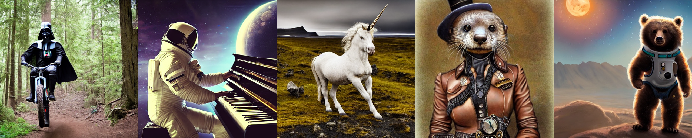
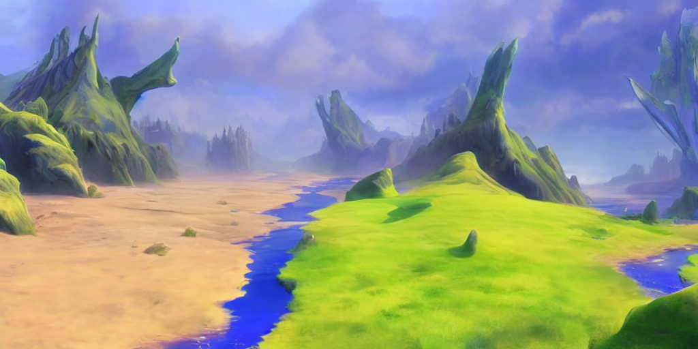
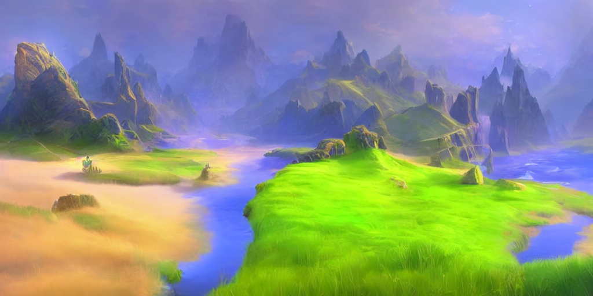

# ANU

[**High-Resolution Image Synthesis with Latent Diffusion Models**](https://ommer-lab.com/research/latent-diffusion-models/)<br/>
[Robin Rombach](https://github.com/rromb)\*,
[Andreas Blattmann](https://github.com/ablattmann)\*,
[Dominik Lorenz](https://github.com/qp-qp)\,
[Patrick Esser](https://github.com/pesser),
[Björn Ommer](https://hci.iwr.uni-heidelberg.de/Staff/bommer)<br/>
_[CVPR '22 Oral](https://openaccess.thecvf.com/content/CVPR2022/html/Rombach_High-Resolution_Image_Synthesis_With_Latent_Diffusion_Models_CVPR_2022_paper.html) |
[GitHub](https://github.com/CompVis/latent-diffusion) | [arXiv](https://arxiv.org/abs/2112.10752) | [Project page](https://ommer-lab.com/research/latent-diffusion-models/)_


[Stable Diffusion](#stable-diffusion-v1) is a latent text-to-image diffusion
model.
Thanks to a generous compute donation from [Stability AI](https://stability.ai/) and support from [LAION](https://laion.ai/), we were able to train a Latent Diffusion Model on 512x512 images from a subset of the [LAION-5B](https://laion.ai/blog/laion-5b/) database. 
Similar to Google's [Imagen](https://arxiv.org/abs/2205.11487), 
this model uses a frozen CLIP ViT-L/14 text encoder to condition the model on text prompts.
With its 860M UNet and 123M text encoder, the model is relatively lightweight and runs on a GPU with at least 10GB VRAM.
See [this section](#stable-diffusion-v1) below and the [model card](https://huggingface.co/CompVis/stable-diffusion).

  
## Requirements
A suitable [conda](https://conda.io/) environment named `ANU` can be created
and activated with:
If you are NOT in China, run the following instrucitons to create the conda environment

```
conda env create -f environment.yaml
conda activate ANU
```

If you are IN China, you can add some local channels for conda using Anaconda Navigator.
Eg:
https://mirrors.tuna.tsinghua.edu.cn/anaconda/cloud/conda-forge/
https://mirrors.tuna.tsinghua.edu.cn/anaconda/pkgs/main/
https://mirrors.tuna.tsinghua.edu.cn/anaconda/pkgs/free/

Run the following instrucitons to create the conda environment

```
conda env create -f environment_china.yaml
conda activate ANU
```

## Models
There are 3 base models in the project. 

The model for text encoder, now we are using CLIP from openAI.
openai\clip-vit-large-patch14\pytorch_model.bin

The base stable diffusion model V1. We are using the 1.5v by default.
models\stable-diffusion\V1-5-pruned.ckpt


## Stable Diffusion v1

Stable Diffusion v1 refers to a specific configuration of the model
architecture that uses a downsampling-factor 8 autoencoder with an 860M UNet
and CLIP ViT-L/14 text encoder for the diffusion model. The model was pretrained on 256x256 images and 
then finetuned on 512x512 images.


### Text-to-Image with Stable Diffusion


Stable Diffusion is a latent diffusion model conditioned on the (non-pooled) text embeddings of a CLIP ViT-L/14 text encoder.
We provide a [reference script for sampling](#reference-sampling-script), but
there also exists a [diffusers integration](#diffusers-integration), which we
expect to see more active community development.

#### Reference Sampling Script

Text to Image
```
python anu.py --prompt "a photograph of an astronaut riding a horse" --work_mode "txt-to-img" --plms 
```

Image to Image
```
python anu.py --prompt "a photograph of an astronaut riding a horse" --work_mode "img-to-img" --init_img "demo.png" 
```

By default, this uses a guidance scale of `--scale 7.5`, [Katherine Crowson's implementation](https://github.com/CompVis/latent-diffusion/pull/51) of the [PLMS](https://arxiv.org/abs/2202.09778) sampler, 
and renders images of size 512x512 (which it was trained on) in 50 steps. All supported arguments are listed below (type `python anu.py --help`).


```commandline
usage: anu.py [-h] [--prompt [PROMPT]] [--outdir [OUTDIR]] [--skip_grid] [--skip_save] [--ddim_steps DDIM_STEPS] [--plms] [--laion400m] [--fixed_code] [--ddim_eta DDIM_ETA]
                  [--n_iter N_ITER] [--H H] [--W W] [--C C] [--f F] [--n_samples N_SAMPLES] [--n_rows N_ROWS] [--scale SCALE] [--from-file FROM_FILE] [--config CONFIG] [--ckpt CKPT]
                  [--seed SEED] [--precision {full,autocast}]

optional arguments:
  -h, --help            show this help message and exit
  --prompt [PROMPT]     the prompt to render
  --outdir [OUTDIR]     dir to write results to
  --skip_grid           do not save a grid, only individual samples. Helpful when evaluating lots of samples
  --skip_save           do not save individual samples. For speed measurements.
  --ddim_steps DDIM_STEPS
                        number of ddim sampling steps
  --plms                use plms sampling
  --laion400m           uses the LAION400M model
  --fixed_code          if enabled, uses the same starting code across samples
  --ddim_eta DDIM_ETA   ddim eta (eta=0.0 corresponds to deterministic sampling
  --n_iter N_ITER       sample this often
  --H H                 image height, in pixel space
  --W W                 image width, in pixel space
  --C C                 latent channels
  --f F                 downsampling factor
  --n_samples N_SAMPLES
                        how many samples to produce for each given prompt. A.k.a. batch size
  --n_rows N_ROWS       rows in the grid (default: n_samples)
  --scale SCALE         unconditional guidance scale: eps = eps(x, empty) + scale * (eps(x, cond) - eps(x, empty))
  --from-file FROM_FILE
                        if specified, load prompts from this file
  --config CONFIG       path to config which constructs model
  --ckpt CKPT           path to checkpoint of model
  --seed SEED           the seed (for reproducible sampling)
  --precision {full,autocast}
                        evaluate at this precision
```
Note: The inference config for all v1 versions is designed to be used with EMA-only checkpoints. 
For this reason `use_ema=False` is set in the configuration, otherwise the code will try to switch from
non-EMA to EMA weights. If you want to examine the effect of EMA vs no EMA, we provide "full" checkpoints
which contain both types of weights. For these, `use_ema=False` will load and use the non-EMA weights.


#### Diffusers Integration
#### Using huggingface's diffusers lib, but you need to login with huggingface-cli
A simple way to download and sample Stable Diffusion is by using the [diffusers library](https://github.com/huggingface/diffusers/tree/main#new--stable-diffusion-is-now-fully-compatible-with-diffusers):
```py
# make sure you're logged in with `huggingface-cli login`
from torch import autocast
from diffusers import StableDiffusionPipeline

pipe = StableDiffusionPipeline.from_pretrained(
	"CompVis/stable-diffusion-v1-4", 
	use_auth_token=True
).to("cuda")

prompt = "a photo of an astronaut riding a horse on mars"
with autocast("cuda"):
    image = pipe(prompt)["sample"][0]  
    
image.save("astronaut_rides_horse.png")
```


### Image Modification with Stable Diffusion

By using a diffusion-denoising mechanism as first proposed by [SDEdit](https://arxiv.org/abs/2108.01073), the model can be used for different 
tasks such as text-guided image-to-image translation and upscaling. Similar to the txt2img sampling script, 
we provide a script to perform image modification with Stable Diffusion.  

The following describes an example where a rough sketch made in [Pinta](https://www.pinta-project.com/) is converted into a detailed artwork.
```
python scripts/img2img.py --prompt "A fantasy landscape, trending on artstation" --init-img <path-to-img.jpg> --strength 0.8
```
Here, strength is a value between 0.0 and 1.0, that controls the amount of noise that is added to the input image. 
Values that approach 1.0 allow for lots of variations but will also produce images that are not semantically consistent with the input. See the following example.

**Input**


**Outputs**




This procedure can, for example, also be used to upscale samples from the base model.


## Comments 

- Our codebase for the diffusion models builds heavily on [OpenAI's ADM codebase](https://github.com/openai/guided-diffusion)
and [https://github.com/lucidrains/denoising-diffusion-pytorch](https://github.com/lucidrains/denoising-diffusion-pytorch). 
Thanks for open-sourcing!

- The implementation of the transformer encoder is from [x-transformers](https://github.com/lucidrains/x-transformers) by [lucidrains](https://github.com/lucidrains?tab=repositories). 


## BibTeX

```
@misc{rombach2021highresolution,
      title={High-Resolution Image Synthesis with Latent Diffusion Models}, 
      author={Robin Rombach and Andreas Blattmann and Dominik Lorenz and Patrick Esser and Björn Ommer},
      year={2021},
      eprint={2112.10752},
      archivePrefix={arXiv},
      primaryClass={cs.CV}
}
```


